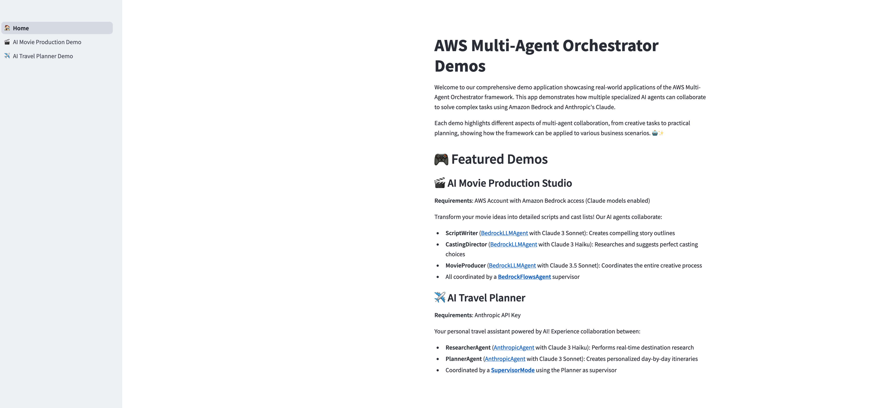

# Agent Squad MVP

🤖 **Multi-Agent AI Assistant** - A powerful chat system with specialized AI agents for various tasks including NeonPanel integration.

[](https://share.streamlit.io/)
[](https://railway.app/new/template)

## 🚀 **QUICK DEMO DEPLOYMENT**

### ⭐ **Option 1: Streamlit Cloud (FREE & INSTANT)**
1. **Fork this repo** or push to your GitHub
2. Go to [**share.streamlit.io**](https://share.streamlit.io/)
3. **New app** → Connect GitHub → Select this repo  
4. **Main file**: `main-app.py`
5. **Deploy!** 🎉 

**Result**: Get instant URL `https://your-app.streamlit.app` (FREE!)

### 🔥 **Option 2: Railway (1-Click, $5/month)**
```bash
npm install -g @railway/cli
railway login && railway init && railway up
```
**Result**: `https://your-app.railway.app`

### 🌐 **Option 3: Render (Free Tier)**
- Connect at [render.com](https://render.com) 
- **Start command**: `streamlit run main-app.py --server.port=$PORT --server.address=0.0.0.0`

---



## 🎯 Project Overview

This MVP is built on the excellent [AWS Agent Squad](https://github.com/awslabs/agent-squad) framework and includes:

1. **Multi-Agent Chat Interface** - Streamlit-based web application with specialized agents
2. **NeonPanel API Integration** - Model Context Protocol (MCP) server connection
3. **Mobile-Ready UI** - Responsive design for mobile devices
4. **Extensible Architecture** - Easy to add new agents and data sources

## 🚀 Current Demos

### 🎬 [AI Movie Production](./movie-production/README.md)
**Requirements**: AWS Account with Amazon Bedrock access (Claude models enabled)

Bring your movie ideas to life with this AI-powered production assistant. Describe your movie concept, select a genre and target audience, and let the system create a comprehensive script outline and recommend actors for the main roles based on real-time research.

### ✈️ [AI Travel Planner](./travel-planner/README.md)
**Requirements**: Anthropic API Key

Enter your destination and travel duration, and the system will research attractions, accommodations, and activities in real-time to create a personalized, day-by-day itinerary based on your preferences.

### 🔧 [NeonPanel Integration]
**Requirements**: NeonPanel API credentials

Connect to your NeonPanel data sources through Model Context Protocol (MCP) server for seamless data access and agent functionality.


## 🚀 Getting Started

### Prerequisites
- Python 3.8 or higher
- For Movie Production Demo:
  - AWS account with access to Amazon Bedrock
  - AWS credentials configured ([How to configure AWS credentials](https://docs.aws.amazon.com/cli/latest/userguide/cli-configure-files.html))
  - Claude models enabled in Amazon Bedrock ([Enable Bedrock model access](https://docs.aws.amazon.com/bedrock/latest/userguide/model-access.html))
- For Travel Planner Demo:
  - Anthropic API Key ([Get your API key](https://console.anthropic.com/account/keys))
- For NeonPanel Integration:
  - NeonPanel API credentials and MCP server setup

### Quick Setup

1. **Automated Setup** (Recommended):
```bash
cd agent-squad-mvp
chmod +x setup.sh
./setup.sh
```

2. **Manual Setup**:
```bash
cd agent-squad-mvp
python -m venv venv
source venv/bin/activate  # On Windows: venv\Scripts\activate
pip install -r requirements.txt
```

3. **Configure Environment**:
```bash
cp .env.example .env
# Edit .env with your API keys
```

4. **Run the Application**:
```bash
# Desktop/Web version
./start-desktop.sh
# OR manually:
source venv/bin/activate && streamlit run main-app.py

# Mobile version (separate terminal)
cd chat-ui && chainlit run app.py
```

### 📱 Mobile App Setup

```bash
cd mobile
npm install
npm run dev
```

## ⚡ Quick Start (Ready to Run!)

**The MVP is ready! Here's how to run it:**

1. **Navigate to the project:**
```bash
cd /Users/applepc/Documents/POc/agent-squad-mvp
```

2. **Install required packages (if not already installed):**
```bash
pip3 install streamlit python-dotenv agent-squad
```

3. **Run the application:**
```bash
python3 -m streamlit run main-app.py
```

4. **Open your browser to:**
```
http://localhost:8501
```

**✅ What's Working:**
- ✅ Basic Streamlit app structure
- ✅ Agent Squad framework integration  
- ✅ Multiple page navigation (Home, Chat, Movie Production, Travel Planner, NeonPanel)
- ✅ NeonPanel MCP client structure
- ✅ Mobile-responsive design
- ✅ Environment configuration ready

**🔧 Next Steps:**
1. Add your API keys to `.env` file
2. Test the agents with your credentials  
3. Customize the NeonPanel integration
4. Deploy mobile version

## 🎮 Featured Demos

### 🎬 AI Movie Production Studio
**Prerequisite**: AWS Account with Amazon Bedrock access (Claude models enabled)

Transform your movie ideas into detailed scripts and cast lists! Our AI agents collaborate:
- **ScriptWriter** ([BedrockLLMAgent](https://awslabs.github.io/agent-squad/agents/built-in/bedrock-llm-agent) with Claude 3 Sonnet): Creates compelling story outlines
- **CastingDirector** ([BedrockLLMAgent](https://awslabs.github.io/agent-squad/agents/built-in/bedrock-llm-agent) with Claude 3 Haiku): Researches and suggests perfect casting choices
- **MovieProducer** ([BedrockLLMAgent](https://awslabs.github.io/agent-squad/agents/built-in/bedrock-llm-agent) with Claude 3.5 Sonnet): Coordinates the entire creative process
- All coordinated by a  [**Custom Agent**](https://awslabs.github.io/agent-squad/agents/custom-agents)  as Supervisor Agent

### ✈️ AI Travel Planner
**Prerequisite**: Anthropic API Key

Your personal travel assistant powered by AI! Experience collaboration between:
- **ResearcherAgent** ([AnthropicAgent](https://awslabs.github.io/agent-squad/agents/built-in/anthropic-agent) with Claude 3 Haiku): Performs real-time destination research
- **PlannerAgent** ([AnthropicAgent](https://awslabs.github.io/agent-squad/agents/built-in/anthropic-agent) with Claude 3 Sonnet): Creates personalized day-by-day itineraries
- Coordinated by a [**Custom Agent**](https://awslabs.github.io/agent-squad/agents/custom-agents) as Supervisor Agent

## 🛠️ Technologies Used
- Streamlit for UI
- AWS Agent Squad for multi-agent collaboration
- Amazon Bedrock for deploying Claude models
- Anthropic's Claude models for AI reasoning
- Python for backend scripting

## 📚 Documentation


Learn more about the AWS Agent Squad framework, including its features and technical details, by visiting the official [documentation](https://awslabs.github.io/agent-squad/).


## 🤝 Contributing

If you want to create a new demo to be included in this global Streamlit demo application, contributions are welcome! Please fork the repository, create a new branch with your changes, and submit a Pull Request for review